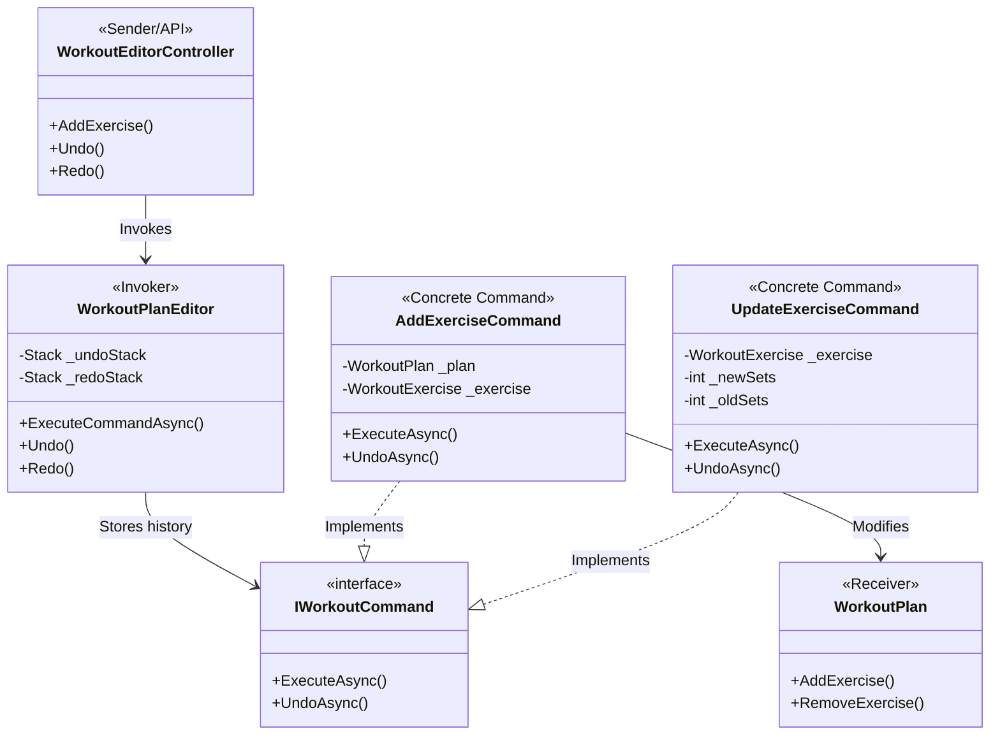

# Design Pattern: Command (Comandă)

## 1. Diagrama UML Schematică
Următoarea diagramă vizualizează modul în care cererile sunt încapsulate în obiecte de tip Comandă și gestionate de un Invoker pentru a permite Undo/Redo.

---

## 2. Definiție pe scurt
**Command** este un pattern de design comportamental care transformă o cerere (o acțiune) într-un obiect de sine stătător care conține toate informațiile despre acea cerere. Această transformare permite:
*   Transmiterea cererilor ca argumente.
*   Amânarea sau adăugarea cererilor într-o coadă (queue).
*   **Suportarea operațiilor reversibile (Undo/Redo).**

---

## 3. Problema rezolvată în proiectul tău
Atunci când un antrenor editează un plan de antrenament, acesta poate face greșeli (ex: adaugă un exercițiu greșit sau modifică numărul de serii incorect).

**Fără Command:**
Acțiunile ar fi executate direct pe modelul de date. Dacă antrenorul vrea să anuleze o acțiune, sistemul nu ar avea nicio memorie a stării anterioare, forțând utilizatorul să modifice totul manual înapoi.

**Prin implementarea Command:**
*   **Encapsulare:** Fiecare acțiune de editare devine un obiect (`AddExerciseCommand`, `UpdateExerciseCommand`).
*   **Istoric Reversibil:** `WorkoutPlanEditor` păstrează o stivă de comenzi. Când apeși "Undo", sistemul știe exact ce comandă a fost ultima și apelează metoda ei de `UndoAsync()`, care știe cum să inverseze efectul (ex: dacă am adăugat, acum șterg).
*   **Separarea Responsabilităților:** Controller-ul de API doar primește cererea, dar nu știe *cum* se execută ea; el doar deleagă lucrul obiectului Command.

---

## 4. Rezultatul observat (Demonstrație)
În terminalul de backend, vei vedea log-uri de tipul:
*   `[COMMAND EXECUTED] Add Exercise: Bench Press`
*   `[COMMAND UNDO] Add Exercise: Bench Press` -> Exercițiul este eliminat automat din plan.
*   `[COMMAND REDO] Add Exercise: Bench Press` -> Exercițiul reapare în plan.
