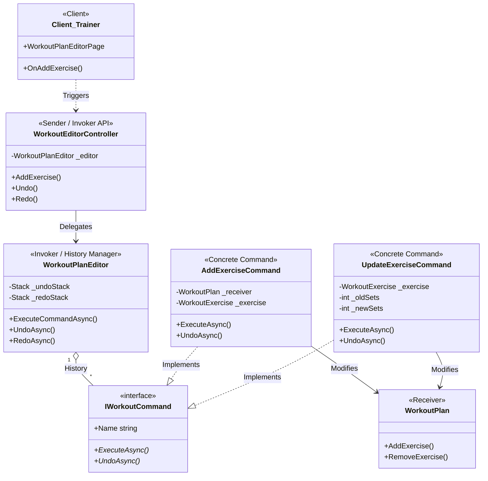

# Design Pattern: Command (Comandă)

## 1. Structura Pattern-ului în Proiect
Următoarea diagramă vizualizează modul în care acțiunile de editare sunt încapsulate și gestionate pentru a permite funcționalitatea de **Undo/Redo**.

## 2. Rolurile Componentelor (Conform Refactoring.Guru)
Iată cum se mapează codul tău pe structura standard a pattern-ului Command:

| Rol | Componenta din Proiect | Responsabilitate |
| :--- | :--- | :--- |
| **Command** | `IWorkoutCommand` | Definește interfața comună pentru toate comenzile (`Execute`, `Undo`). |
| **Concrete Command** | `AddExerciseCommand`, `UpdateExerciseCommand` | Implementează acțiunea și salvează backup-ul stării (ex: `_oldSets`). |
| **Invoker** | `WorkoutPlanEditor` | Păstrează istoricul (stivele) și declanșează execuția comenzilor. |
| **Receiver** | `WorkoutPlan` / `WorkoutExercise` | Obiectele finale care conțin logica de business și sunt modificate. |
| **Sender** | `WorkoutEditorController` | Inițiază cererea către Invoker. |
| **Client** | `WorkoutPlanEditorPage` (UI) | Configurează obiectele comandă și le asociază cu expeditorii. |

---

## 3. Implementarea Undo/Redo
Proiectul tău folosește o abordare bazată pe **Istoric de Obiecte**:
1.  **Backup**: Înainte de execuție, comenzile stochează starea anterioară (ex: numărul vechi de repetări).
2.  **Undo Stack**: După `Execute()`, comanda este pusă în `_undoStack`.
3.  **Redo Stack**: Când se apelează `Undo()`, comanda este scoasă din `_undoStack`, inversată, și pusă în `_redoStack`.
4.  **Reset**: Orice comandă nouă executată golește `_redoStack` pentru a menține consistența istoricului.

---

## 4. De ce am folosit acest pattern?
*   **Decuplare**: UI-ul nu știe cum să salveze un plan, el doar trimite o comandă.
*   **Extensibilitate**: Putem adăuga oricând o comandă de `DeletePlanCommand` sau `ReorderCommand` fără să modificăm restul codului.
*   **Siguranță**: Antrenorul poate experimenta cu planul de antrenament fără teama de a strica ceva, având mereu butonul de Undo la dispoziție.
