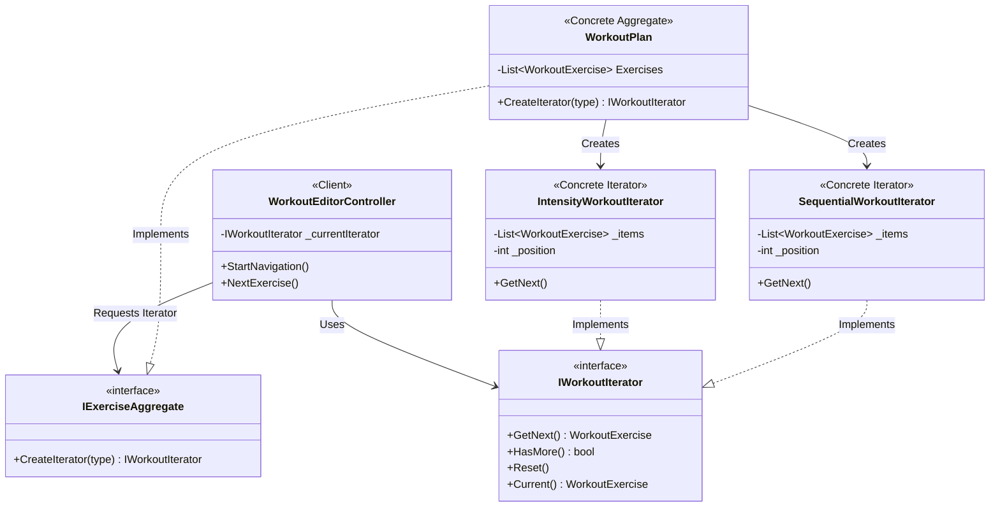

# Design Pattern: Iterator

## 1. Structura Pattern-ului în Proiect
Următoarea diagramă vizualizează modul în care planul de antrenament expune diferite modalități de parcurgere a exercițiilor fără a-și schimba structura internă.

## 2. Rolurile Componentelor
Conform definiției oficiale, iată cum este implementat Iterator în proiectul tău:

| Rol | Componenta | Responsabilitate |
| :--- | :--- | :--- |
| **Aggregate Interface** | `IExerciseAggregate` | Definește metoda de fabrică pentru crearea iteratorilor. |
| **Concrete Aggregate** | `WorkoutPlan` | Colecția reală. Ea știe să genereze iteratori compatibili cu datele sale. |
| **Iterator Interface** | `IWorkoutIterator` | Definește metodele de navigare (`GetNext`, `HasMore`). |
| **Concrete Iterators** | `SequentialWorkoutIterator`, `IntensityWorkoutIterator` | Implementează algoritmi diferiți de parcurgere (Unul după ordine, altul după volumul de muncă). |
| **Client** | `WorkoutEditorController` | Folosește iteratorul pentru a "ghida" antrenorul prin exerciții fără a manipula direct lista. |

---

## 3. Problema rezolvată
În loc ca logica de sortare și navigare să fie amestecată în codul de UI sau în clasa `WorkoutPlan`, am extras-o în obiecte de tip Iterator.

**Beneficii:**
1.  **Strategii Multiple**: Putem trece de la "Vreau să fac exercițiile în ordine" la "Vreau să le fac pe cele mai grele primele" doar schimbând iteratorul, nu și datele.
2.  **Stare Izolată**: Putem avea mai mulți iteratori în același timp pe același plan (ex: unul pentru vizualizare, unul pentru execuție), fiecare având propriul `_position`.
3.  **Capsulare**: Controller-ul nu știe că în spate este o `List<WorkoutExercise>`. El știe doar să ceară `GetNext()`.

---

## 4. Integrarea în UI
În secțiunea **"Mod Navigator (Iterator)"** din sidebar:
*   **Selectorul de Strategie**: Poți alege între **Secvențial** și **Intensitate**.
*   **Start Antrenament**: Inițializează iteratorul ales.
*   **Butonul Următorul**: Folosește metoda `GetNext()` a iteratorului pentru a trece la pasul următor.
*   **Focus Dinamic**: Interfața afișează exercițiul returnat de iteratorul activ.
