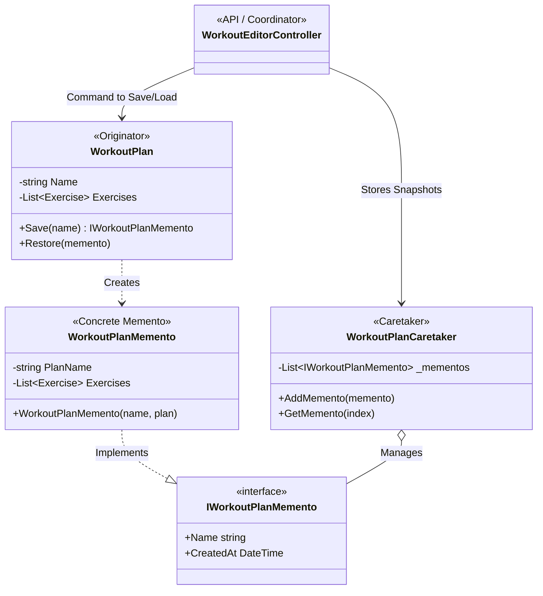

# Design Pattern: Memento (Snapshot)

## 1. Structura Pattern-ului în Proiect
Următoarea diagramă vizualizează modul în care starea întreagă a unui plan de antrenament este salvată și restaurată folosind obiecte Memento.

## 2. Rolurile Componentelor
Conform definiției oficiale, iată cum este implementat Memento în proiectul tău:

| Rol | Componenta | Responsabilitate |
| :--- | :--- | :--- |
| **Originator** | `WorkoutPlan.cs` | Obiectul a cărui stare vrem să o salvăm. El creează memento-ul și știe să își restaureze starea din el. |
| **Memento** | `WorkoutPlanMemento.cs` | Obiectul "cutie neagră" care stochează starea. Este imutabil pentru a preveni modificarea accidentală a backup-ului. |
| **Caretaker** | `WorkoutPlanCaretaker.cs` | Modulul care păstrează lista de versiuni (checkpoints). El nu știe *ce* este înăuntru, doar le stochează. |

---

## 3. Problema rezolvată
În timp ce pattern-ul **Command** ne oferă Undo pas-cu-pas, **Memento** ne oferă "puncte de restaurare" majore (Checkpoints). 

**Fără Memento:**
Dacă un antrenor dorea să salveze o variantă a planului înainte de a încerca o schimbare radicală (ex: trecerea de la Cardio la Hypertrophy), trebuia să salveze manual datele sau să facă zeci de pași de Undo.

**Cu Memento:**
1.  Antrenorul scrie "Versiunea Cardio" și apasă **Save Snapshot**.
2.  Încearcă modificări noi.
3.  Dacă nu îi place rezultatul, apasă **Load** pe "Versiunea Cardio" și tot planul (nume, setări, exerciții) revine la starea exactă din acel moment.

---

## 4. Integrarea în UI
În interfața de editare, pe coloana din dreapta, ai acum secțiunea **"Versiuni Plan (Memento)"**.
*   **Iconița Cameră Foto**: Simbolizează un "Snapshot" al stării curente.
*   **Butonul Save**: Creează un memento nou.
*   **Lista de versiuni**: Afișează toate "fotografiile" făcute planului, cu posibilitatea de restaurare instantanee.
