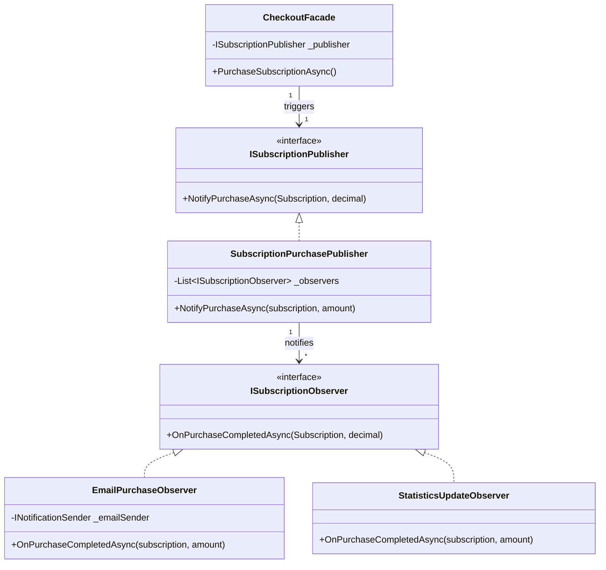

# Design Pattern: Observer (Observator)

## 1. Definiție pe scurt
**Observer** este un pattern de design comportamental care stabilește o relație de tip "unu-la-mulți" între obiecte. Atunci când starea unui obiect (numit **Subiect** sau **Publisher**) se schimbă, toate obiectele dependente (**Observatori** sau **Subscribers**) sunt notificate și actualizate automat.

## 2. Problema rezolvată în proiectul tău
Înainte de implementarea acestui pattern, codul din `CheckoutFacade` (procesul de plată) trebuia să se ocupe de prea multe lucruri simultan:
*   Să salveze abonamentul.
*   Să proceseze plata prin Stripe.
*   **Să știe cum să trimită un email.**
*   **Să știe cum să curețe cache-ul de statistici.**

Această abordare făcea codul greu de întreținut și încălca principiul **Single Responsibility**. 

**Prin Observer:**
*   `CheckoutFacade` doar anunță: *"Hei, s-a terminat o achiziție!"*.
*   Există obiecte separate (`EmailPurchaseObserver`, `StatisticsUpdateObserver`) care „ascultă” acest anunț și își fac treaba lor independent.
*   Dacă pe viitor vrei să mai adaugi o acțiune (ex: acordarea unui bonus), adaugi doar un nou Observator, fără să mai modifici codul de plată.

---

## 3. Diagrama UML Schematică

## 4. Rezultatul observat în log-uri (Demonstrație)
Atunci când ai rulat plata, ai văzut exact pașii pattern-ului:
1.  **Trigger:** `[OBSERVER PATTERN] Step 1: Initiating notifications...`
2.  **Dispatch:** `[Publisher] Notifying 2 observers...`
3.  **Action 1 (Email):** `[SMTP MOCK] Felicitări pentru achiziție...`
4.  **Action 2 (Stats):** `[StatisticsObserver] Triggering status recalculation...`
