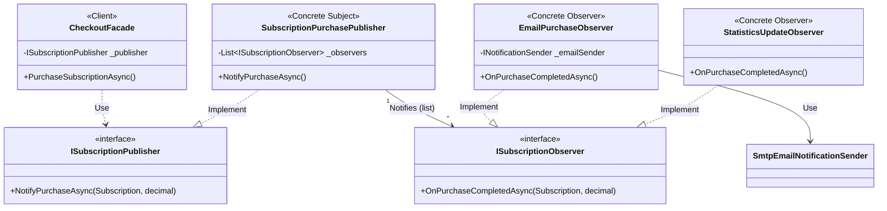

# Design Pattern: Observer (Observator)

## 1. Diagrama UML Schematică
Următoarea diagramă vizualizează relația dintre Subiect (Publisher), interfața de observare și observatorii concreți care reacționează la evenimente.

### Explicația Componentelor:
*   **CheckoutFacade (Client):** Inițiază procesul de achiziție și declanșează notificările prin intermediul Publisher-ului.
*   **ISubscriptionPublisher (Interfață):** Definește mecanismul de notificare a observatorilor.
*   **SubscriptionPurchasePublisher (Subiect):** Menține lista de observatori și îi parcurge pentru a-i notifica la finalizarea unei plăți.
*   **ISubscriptionObserver (Interfață):** Definește metoda `OnPurchaseCompletedAsync` pe care toți observatorii trebuie să o implementeze.
*   **EmailPurchaseObserver & StatisticsUpdateObserver (Observatori Concreți):** Realizează acțiunile specifice (trimitere email, respectiv invalidare cache statistici) în mod independent.

---

## 2. Definiție pe scurt
**Observer** este un pattern de design comportamental care stabilește o relație de tip "unu-la-mulți" între obiecte. Atunci când starea unui obiect (numit **Subject**) se schimbă, toate obiectele dependente (**Observers**) sunt notificate și actualizate automat, fără ca subiectul să știe exact cine sau câți observatori există.

---

## 3. Problema rezolvată în proiectul tău
În procesul de checkout, după o plată reușită, trebuiau executate mai multe acțiuni care nu aveau legătură directă între ele:
1.  **Trimiterea unui email de confirmare** (Infrastructură/Comunicare).
2.  **Actualizarea statisticilor globale** (Business Intelligence/Cache).

**Fără Observer**, codul de achiziție ar fi fost „murdărit” cu dependințe către servicii de email și manageri de statistici. 

**Prin implementarea Observer:**
*   **Decuplare Totală:** `CheckoutFacade` nu știe că există un serviciu de email sau de statistici. El doar emite un eveniment.
*   **Extensibilitate (Open/Closed Principle):** Putem adăuga oricând un al treilea observator (ex: un serviciu de logging sau de bonusuri) fără să modificăm nicio linie de cod în procesul de plată.
*   **Responsabilitate Unică:** Fiecare observator se ocupă strict de logica lui, lăsând procesul de achiziție curat și rapid.
