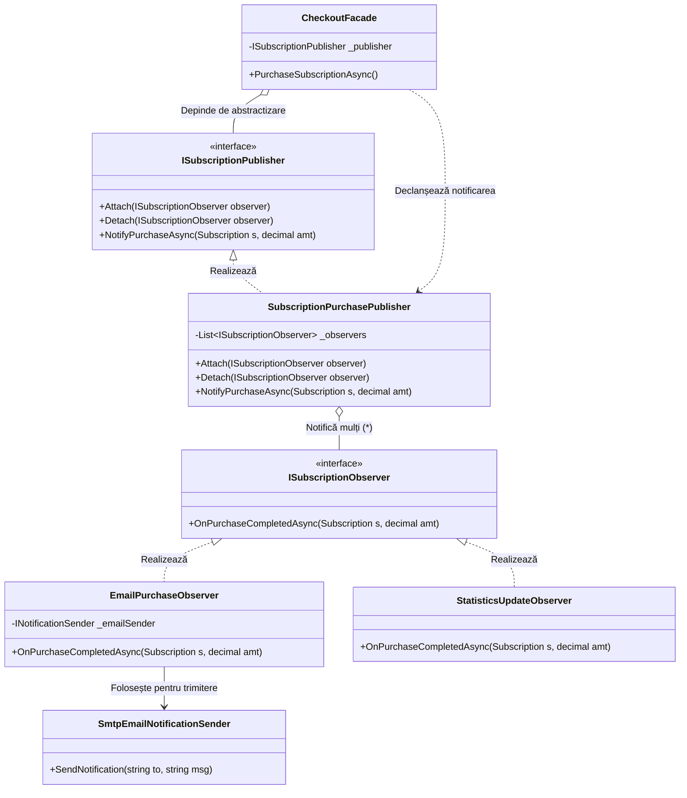

# Implementarea Pattern-ului Observer în FitnessApp

Acest document descrie modul în care a fost implementat pattern-ul **Observer** pentru a gestiona evenimentele asincrone și decuplarea serviciilor de notificare în cadrul aplicației.

## 1. Diagrama UML Schematică

Următoarea diagramă vizualizează modul în care Publisher-ul (Subiectul) comunică cu Observatorii fără a depinde de implementările lor concrete.

---

## 2. Ce este Pattern-ul Observer?

> [!NOTE]
> **Definiție Simplă:** Observer este un pattern comportamental care îți permite să definești un mecanism de abonare pentru a notifica automat mai multe obiecte (Observatori) despre orice eveniment care se întâmplă cu un alt obiect (Subiectul).

Este ca un abonament la o revistă: Editura (Subiectul) trimite noua ediție tuturor Abonaților (Observatorii) imediat ce este publicată, fără ca aceștia să trebuiască să meargă periodic la magazin să verifice.

---

## 3. Ce problemă rezolvă în proiectul tău?

Înainte de acest pattern, clasa ta `CheckoutFacade` trebuia să se ocupe de tot: salvarea în baza de date, trimiterea email-ului de confirmare, actualizarea statisticilor și logarea tranzacției.

### Beneficii directe:

1.  **Decuplare (Loose Coupling):** `CheckoutFacade` nu mai știe nimic despre email-uri sau statistici. El doar anunță: *"S-a vândut un abonament!"*. 
2.  **Extensibilitate:** Dacă vrei să adaugi o notificare prin SMS sau un sistem de "Achievement" (ex: „Primul Abonament cumpărat”), doar creezi un nou Observator și îl adaugi în sistem, fără să atingi codul de plată.
3.  **Principiul Single Responsibility:** Fiecare componentă face un singur lucru. `EmailPurchaseObserver` se ocupă doar de formatarea și trimiterea mesajului.
4.  **Actualizări în Timp Real:** Observatorii reacționează instantaneu la schimbarea stării subiectului.

---

## 4. Integrarea SMTP (Gmail)

> [!CAUTION]
> **De ce nu pleacă email-urile acum?**
> Am implementat arhitectura de trimitere, dar pentru a folosi **Gmail** cu succes, trebuie să completezi datele tale în [appsettings.json](file:///Users/crivoidan/Desktop/all/fitnessApp/backend/FitnessApp.API/appsettings.json).

### Pași pentru activare Gmail:
1.  **Host:** `smtp.gmail.com`
2.  **Port:** `587`
3.  **Username:** Email-ul tău de Gmail.
4.  **Password (IMPORTANT):** Nu folosi parola ta normală! 
    - Mergi la [Google Account -> Security](https://myaccount.google.com/security).
    - Activează **2-Step Verification**.
    - Caută secțiunea **App Passwords**.
    - Generează o parolă pentru „Mail” și copiază codul de 16 caractere în `appsettings.json`.

---

## 5. Observer pe Frontend (EventBus)

Pe partea de interfață, am implementat un `EventBus.js` în `/utils/Observer/`. Acesta permite componentei de checkout să „strige” succesul tranzacției, permițând oricărei alte părți a aplicației să reacționeze fără a fi legate direct prin „props” sau „state management” complex.
